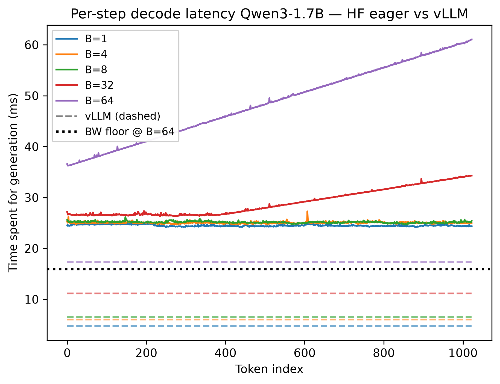

# llm-inference-learning

In this repo I will post the results of my work on obtaining the inference position. You will see various benchmarks and other. 



## Results

- vLLM: 0.98–1.22× of the bandwidth floor predicted before renting the GPU
- HuggingFace eager `generate()`: 1.8–6.3× above the same floor (kernel-launch overhead at small batch, KV-cache copy traffic at large batch)
- Total GPU cost of the experiment: $1.57 (RTX 4090, Vast.ai)

## Write-ups

The full method and analysis live in two posts:

- [Decode is memory-bound and KV-cache is the biggest bottleneck in LLM inference](https://dmytro-khvedchuk.notion.site/Decode-is-memory-bound-and-KV-cache-as-the-biggest-bottleneck-in-LLM-inference-3a12056018d080ef9874fe9601420c40)
- [How to predict LM performance before actually running anything on the hardware](https://dmytro-khvedchuk.notion.site/How-to-predict-LM-performance-before-actually-running-anything-on-the-hardware-3a32056018d080bea1b0da14138aebd4)

## Repo map

| Folder | What it is |
|---|---|
| `naive_hf_vs_vllm_benchmark/` | The benchmark harness: `hf_benchmark.py`, `vllm_benchmark.py`, `bandwidth_check.py` (measures achievable GDDR bandwidth — the floor denominator), `figures.py` |
| `naive_hf_vs_vllm_benchmark/artifacts/` | Raw per-run JSONLs from the rental day |
| `naive_hf_vs_vllm_benchmark/figures/` | The plots used in the posts |
| `decode_loop_from_scratch/` | Hand-written inference loop: prefill/decode split, KV-cache threading, sampling pipeline |
| `nano_gpt_karpathy/` | Character-level GPT from scratch, following Karpathy |

## Running

```bash
uv sync

# bandwidth microbench (any CUDA GPU):
uv run python naive_hf_vs_vllm_benchmark/bandwidth_check.py

# the two benchmark sides (CUDA GPU required; vLLM side needs vllm installed):
uv run python naive_hf_vs_vllm_benchmark/hf_benchmark.py
uv run python naive_hf_vs_vllm_benchmark/vllm_benchmark.py

# regenerate figures from the JSONLs (no GPU needed):
uv run python naive_hf_vs_vllm_benchmark/figures.py
```

Benchmark configs (models, batch sizes, prompt/completion lengths) are at the top of the two benchmark scripts.

All numbers in `artifacts/` come from a single rental day (2026-07-17) on an RTX 4090 rented via Vast.ai — 919.8 GB/s measured device-to-device bandwidth, vLLM 0.25.1, torch 2.11.0+cu130, CUDA driver 13.2. On different hardware or library versions your numbers will differ.

## About

You can also track my [blogs](https://dmytro-khvedchuk.notion.site/blogs)!
